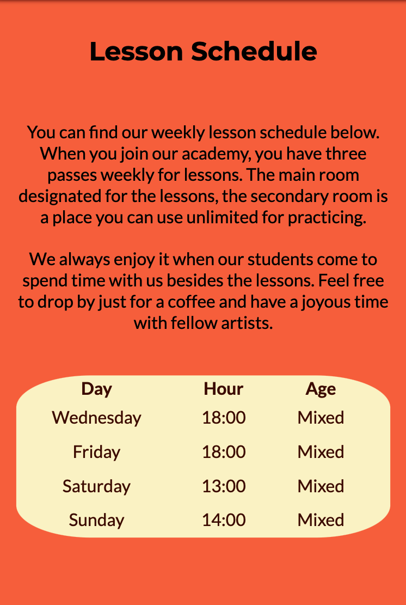
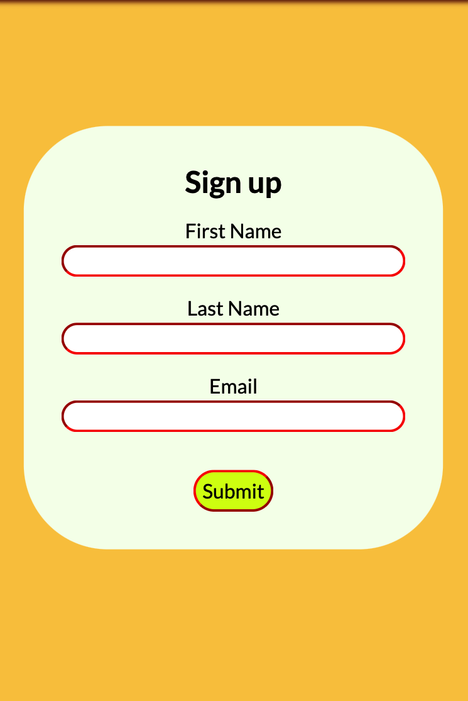
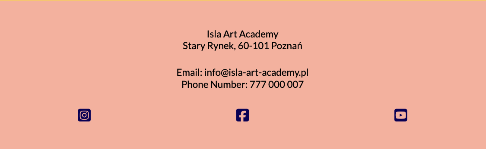
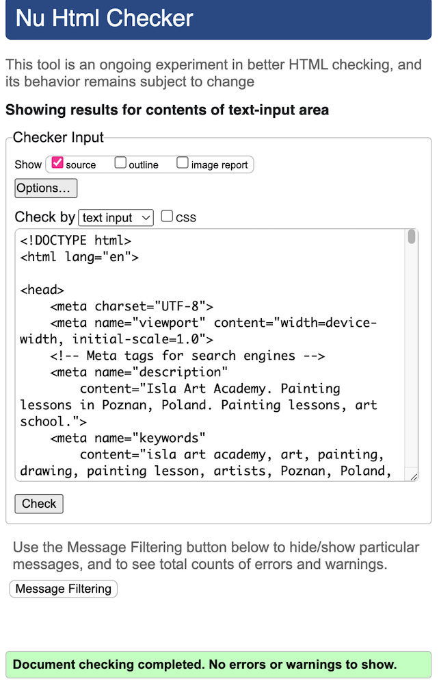
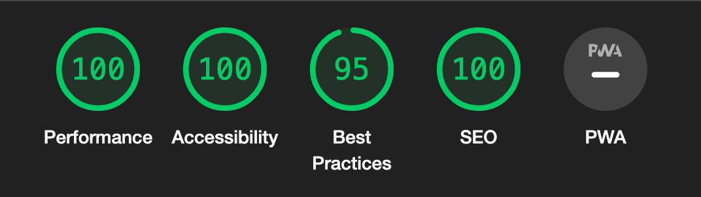

# Isla Art Academy

The Isla Art Academy website is created to showcase the academy's identity and offer painting classes to interested individuals. The website is beneficial for users who want to learn more about the school, view the class schedule, and send an application form to join studies. The academy offers lessons to everyone, from beginners to advanced students of all ages.

Visit the deployed [website](https://serrakd.github.io/isla-art-academy/).

## Table Of Contents

1. [User Experience (UX)](#user-experience-ux)
2. [Wireframes](#wireframes)
3. [Color Scheme](#color-scheme)
4. [Features](#features)
   1. [Existing Features](#existing-features)
      - [Main Menu](#main-menu)
      - [Hero Section](#hero-section)
      - [About Us Section](#about-us-section)
      - [Lesson Schedule Section](#lesson-schedule-section)
      - [Sign Up Section](#sign-up-section)
      - [Footer](#footer)
   2. [Features Left to Implement](#features-left-to-implement)
5. [Testing](#testing)
   1. [Manual Testing](#manual-testing)
   2. [Validator Testing](#validator-testing)
   3. [Accesibility Testing](#accesibility-testing)
   4. [Unfixed Bugs](#unfixed-bugs)
6. [Deployment](#deployment)
7. [Credits](#credits)
   1. [Content](#content)
   2. [Media](#media)
8. [Acknowledgements](#acknowledgements)

---

## User Experience (UX)

### Site Goals

- User-friendly website structure to ensure people of all ages easily access the information they need.
- Learn about our lesson schedule and details of the program.
- Fill out a signup form to join classes and get in touch with the academy.

### Target Audiences

- Individuals of all ages searching for painting lessons.
- Individuals of all ages interested in art.

### User Stories 

- As a user, I want to navigate easily through the website and find clear information about pages' subject matter.
- I want to find instructive, straightforward information about the services provided.
- I expect easy access to social media links and contact information.
- I should be able to sign up for services effortlessly.

## Wireframes

At the planning stage I used Balsamiq wireframes to create the basic layout of the website.

| Section | Mobile View | Desktop View |
| ---- | :----: | :----: |
| Hero |  |  |
| About |  |  |
| Sign Up & Contact |  | |

## Color Scheme

I decided to pick colors that are coherent to the hero image. I chose bright and intensive colors to maintain users' interest and create a minimalistic but visually pleasing website. The Contrast Grid is used to ensure the website is accessible.

## Features

The website consists of one page with five sections. My main goal was to 
create a website that is modest and useful. 

The contents are straight to the purpose while having pleasing visuals. 

### Existing Features

---

### __Main Menu__

The Main menu is fixed on top of the page and has the Academy name as a header with a navigation bar.

- Navigation bar items have a hover effect on large screens.

- Because the Academy name is long, I styled the main menu differently for small, medium, and large screens for compatibility.

| Screen Size | Image |
| :---- | :----: |
| Small Screen |  |
| Medium Screen |  |
| Large Screen |  |

### __Hero Section__

At first, the hero image I picked was one color simple watercolor paint, but then I decided it was not striking enough and changed to the current image. I tried to set the heading on the image to specifically not to come on top of white strikes in the painting.

- This section contains a heading and a background image of a colorful painting.

- The main goal of this section is to get the user's attention simply with the intriguing heading and image.

| Device | Image |
| :---- | :----: |
| Phone |  |
| Tablet |  |
| Laptop |  |

### __About Us Section__

This section contains straightforward information about the Academy's principles, target audience, and education methods.

The main goal is to give significant information without losing the user's interest. 

- It encourages users to join the academy while giving them information on how to get in touch.

| Device | Image |
| :---- | :----: |
| Phone |  |
| Tablet |  |
| Laptop |  |

### __Lesson Schedule Section__

The initial design had the Lesson Schedule as part of the About Us section. Later I decided to split it into two different sections for a better layout. 

- This section contains details of the weekly lesson plan and the manner of using the classrooms.

| Device | Image |
| :---- | :----: |
| Phone |  |
| Tablet |  |
| Laptop |  |

### __Sign Up Section__

This section contains a signup form for users to easily join the academy.

- The user has to fill out the form completely to be able to submit it.

| Device | Image |
| :---- | :----: |
| Phone |  |
| Tablet |  |
| Laptop |  |

### __Footer__

The footer contains the contact information and social media links. 

- Can be reached easily by a user from the main menu _Contact_ link.

I decided to put this information together so that users can use the social platforms as an option to contact the academy if they choose.

| Device | Image |
| :---- | :----: |
| Phone |  |
| Tablet |  |
| Laptop |  |

> __Contact__

- Contact information includes the Academy's address, phone number, and email.

> __Socials__

- Social media links are Instagram, Facebook, and YouTube.

- When clicked on, it takes the user to the main page of the social media platform in a new tab. They have a hover effect on large screens for an interactive layout.

### Features Left to Implement

- In the future, I would like to add a gallery page to the website that connects Isla Art Academy with Isla Art Gallery. There, users can view and purchase the paintings created by students of the academy and local artists.

## Testing

Throughout the development process, I tested the project regularly with  [Chrome Dev tools](https://developer.chrome.com/docs/devtools/).

- For each element and section, I experimented  with dev tools for a better layout and  responsiveness.

- Following the mobile-first rule, I designed elements and layout for the smallest screen and worked up to the big screen. I tested every change in this manner.

- I tried to record all changes made by this testing process with meaningful and detailed commit messages. Some examples are shown below.

| Commit | Commit Message | Fix reason |
| ---- | :----: | ---- |
| [3c00397](https://github.com/SerraKD/isla-art-academy/commit/3c00397d3cbeef84b0b07c700ce1df232715e571) | Change iimported font family to Lato and Montserrat | Poor user feedback for the first picked font family Lora & Libre Baskerville. |
| [8ded3ec](https://github.com/SerraKD/isla-art-academy/commit/8ded3ecba60660e1b8c9a7361be3aadc5554c3b6) | Make contact link work by changing footer id in index.html | During development, i realised that contact link on nav-bar is not working. |
| [175332f](https://github.com/SerraKD/isla-art-academy/commit/175332f312687f25a906376ba94775eff8fe4ee6) | Change logo to h1 heading and remove from list items | I wanted heading and nav-bar items to move separately for different screen sizes for better responsiveness. |
| [58d7b87](https://github.com/SerraKD/isla-art-academy/commit/58d7b8710b32287a6b4519dfe304cdf2de95b2a5)| Add padding to main heading to give breathing space | The main heading was too close to the top left corner of the page, creating a poor visual effect. |
| [2e7266b](https://github.com/SerraKD/isla-art-academy/commit/2e7266b2e90b16d3b9faee6e6c535e0680a49eed)| Add padding to hero heading to make it clear on smallest mobile device | Some letters of the white text for the heading were coming on top white stikes in the hero image.  I added extra padding and media query for medium-size devices to prevent this issue. | 

### __Manual Testing__

I tested manually all elements and pages on different size devices and browsers, and found no errors besides below ones.

- On dev tools, for mobile screens submit button text is black but when I go to the deployed page from my iPhone I find out that the text color for the submit button is white. I added a  black text color and font family Lato to the submit button styles to make sure this issue is fixed.

- Excessive padding for the signup section created a visually poor experience. I reduced the top and bottom padding for a better look on all devices and browsers.

I used 4 different browsers for manual testing and I didn't find issues.

- Chrome
- Safari
- Edge
- Mozilla Firefox

### __Validator Testing__

- [V3C HTML](https://validator.w3.org/) and [V3C CSS](https://jigsaw.w3.org/css-validator/) was used for validator testing.

| Page | [V3C HTML](https://validator.w3.org/) | Result |
| :----: | :----: | :----: |
| index.html |  |  No error found |
| 404.html |  |  No error found |

| Page | [V3C CSS](https://jigsaw.w3.org/css-validator/) | Result |
| :----: | :----: |  :----: |
| style.css |  | No error found |

### __Accesibility Testing__

- [Page Speed](https://pagespeed.web.dev/) and [Lighthouse](https://developer.chrome.com/docs/lighthouse/overview) was used for accesibility testing.

- Pagespeed mobile has a lower performance score due to image size and format. I didn't add any changes because the quality and size of the image are crucial for the website structure.

| Device | [Page Speed](https://pagespeed.web.dev/) | [Lighthouse](https://developer.chrome.com/docs/lighthouse/overview) |
| :----: | :----: | :----: |
| Mobile |  |  |
| Desktop |  |  |

### Unfixed Bugs

## Deployment

I used [Gitpod](https://gitpod.io/) to develop this website.

I deployed the website on [GitHub](https://github.com/) with following steps;

1. Log in to Github and go to projects' repository.
2. Find the Settings on the top of the repository and click.
3. On the left side of the screen, find Pages and select.
4. Under the Branch section, click on the dropdown that says none, and pick "Main" and click on save button.
4. The page is now deployed.

Visit the deployed website [here](https://serrakd.github.io/isla-art-academy/).

## Credits

- Hero image inspiration was taken from the Love Running project.

- Post action for signup form was taken from [Code Institute](https://formdump.codeinstitute.net).

- All fonts were imported from [Google Fonts](https://fonts.google.com/).

- Social media icons taken from [Font awesome](https://fontawesome.com/).

- Fav icon taken from [favicon](https://favicon.io/emoji-favicons/artist-palette/).

- Wireframes made with [Balsamiq](https://balsamiq.com/).

- [Tiny PNG](https://tinypng.com/) was used for file compression.

- [Am I responsive?](https://ui.dev/amiresponsive) was used for responsive mockup.

- For color contrast checking i used [Eightshapes](https://contrast-grid.eightshapes.com/).

- [Dev Tools](https://developer.chrome.com/docs/devtools/) was used throughout the project for testing, troubleshooting, and styling.

- Instructions for Markdown styntax taken from [Tapas Adhikary](https://github.com/atapas/markdown-cheatsheet) & [Markdown Guide](https://www.markdownguide.org/extended-syntax/).

- To check the grammar of all text content, I used [Grammarly](https://app.grammarly.com/).

- README.md structure inspration by Ilyas Olgun's project [Paws Play](https://github.com/ilyasolgun11/paws-play-pp1).

### Content

- All content was written by me.

### Media

- The photo used as background image taken from [Pexels](https://www.pexels.com/). Photo by [Steve Johnson](https://www.pexels.com/photo/multi-coloured-abstract-painting-1372990/)

## Acknowledgements

- My tutor, Rory Patrick Sheridan, provided great support, beneficial tips, and invaluable guidance. 

- My husband, his valuable feedback and requests as a user.
